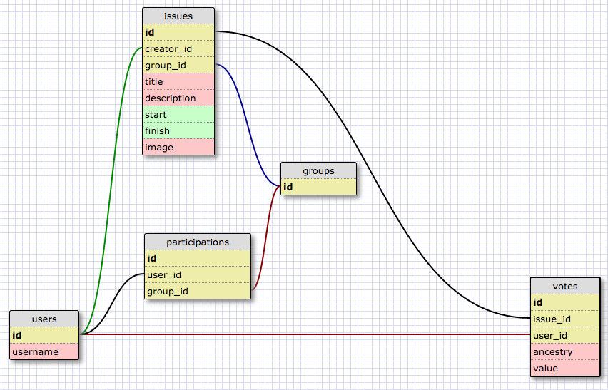

# Syndicate

Syndicate is an experimental online voting platform for small teams and groups of people.

With a back-end built on Ruby on Rails and using PostgreSQL, Syndicate seeks to implement the idea of Liquid Democracy where voters can choose to either vote directly on individual issues, or delegate their vote to a representative. It does so with an intuitive and responsive web design. The interface and results are updated live for all users watching the votes, leveraging jQuery, AJAX, and Firebase.

The first MVP of Syndicate was completed in one week.

## Deployment

Syndicate is deployed on Heroku with Puma.

* [Production](https://dbc-syndicate.herokuapp.com)
* [Test](https://dbc-syndicate-test.herokuapp.com)

## Git Workflow

0. working on your local feature branch you have added and committed your changes locally
1. git fetch origin test-master
2. git merge origin/test-master
3. resolve conflicts (call teammate to help)
4. TEST the application locally
5. git push origin feature-branch
6. create pull request on github from feature-branch to test-master
7. wait for another member of the team to merge pull request

## Development Environment

Remember to create your .env file locally otherwise you will not be able to access Firebase.

* create a .env file "touch .env" - in the root of the project
* add the line FIREBASE_URL=https://your-firebase-url.firebaseio.com/

## Watch

A user can select an issue to watch.

## Vote

A user can start voting on a live issue after signing in with his Google account.

## Delegate

A voter can delegate to anyone by clicking on his representative.

## PostgreSQL Schema

